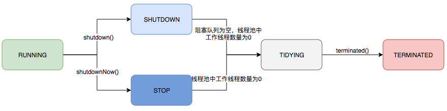

# 线程池
## 池化技术

## 线程池的实现
- ThreadPooolExector UML类图
- 线程池内部构建了一个生产者-消费者模型，将线程和任务解耦, 二者不直接关联，从而有良好的任务缓冲、线程复用。主要分为【任务管理】和【线程管理】两部分，

### 线程池生命周期

## 线程池需要关闭吗？
- 局部线程池，请务必务必要手动关闭

# Reference
- [Java线程池实现原理及其在美团业务中的实践](https://zhuanlan.zhihu.com/p/123328822)
- [Spring官方-scheduling-annotation-support-async](https://docs.spring.io/spring-framework/docs/current/reference/html/integration.html#scheduling-annotation-support-async)
- [springboot通过AsyncConfigurer接口实现异步线程池自动化配置组件](https://blog.csdn.net/yaomingyang/article/details/108165496)
- [线程池运用不当的一次线上事故](https://www.heapdump.cn/article/646639)
- [如何优雅的使用和理解线程池](https://segmentfault.com/a/1190000015808897)